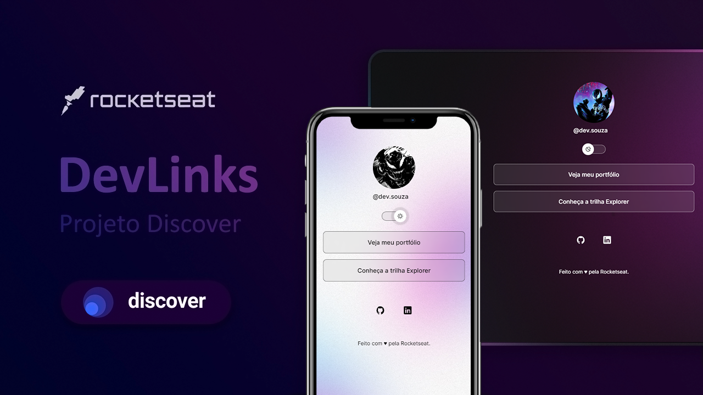

<h1 align="center">DevLinks Rocketseat</h1>

  <a href="#-hospedagem">Hospedagem</a>&nbsp;&nbsp;&nbsp;|&nbsp;&nbsp;&nbsp;
  <a href="#-tecnologias">Tecnologias</a>&nbsp;&nbsp;&nbsp;|&nbsp;&nbsp;&nbsp;
  <a href="#-projeto">Projeto</a>&nbsp;&nbsp;&nbsp;|&nbsp;&nbsp;&nbsp;
  <a href="#-layout">Layout</a>&nbsp;&nbsp;&nbsp;|&nbsp;&nbsp;&nbsp;
  <a href="#-licença">Licença</a>&nbsp;&nbsp;&nbsp;

## ☆ Hospedagem

-   Acesse o link abaixo e veja meu código hospedado online. 
    https://https-shini.github.io/devlinks-rocketseat/

## ☆ Tecnologias

Esse projeto foi desenvolvido com as seguintes tecnologias:

-   HTML
-   CSS
-   JavaScript
-   Git
-   Github
-   Figma

## ☆ Projeto

DevLinks é um agregador de links responsivo e com troca de tema que você pode usar como cartão de visitas nas suas redes sociais.
Esse projeto é desenvolvido com HTML, CSS e JavaScript no Discover, o programa 100% gratuito da Rocketseat para aprender programação.

## ☆ Layout

Você pode visualizar o layout do projeto através [DESSE LINK](https://www.figma.com/community/file/1187422022288947321), mas não se esqueça que é necessário ter conta no [Figma](https://figma.com) para acessá-lo.  
Caso não tenha conta pode visualizar o layout da página inicial do projeto através da foto abaixo. Caso queira ver ele funcionando na íntegra recomendo que acesse o link aqui na parte de Hospedagem e abra o site para ter uma melhor experiência. 

## ☆ Licença

Esse projeto está sob a licença MIT.
